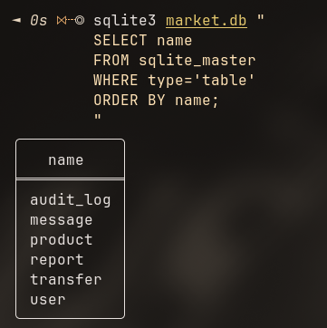
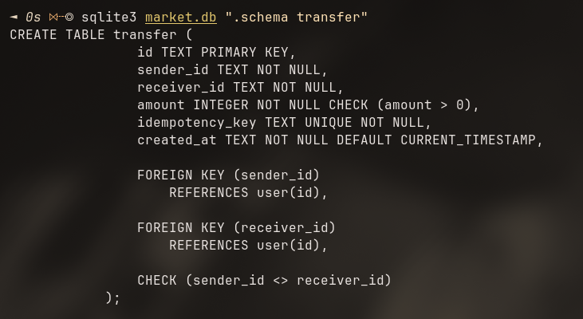
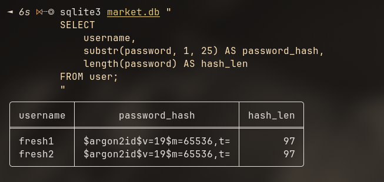
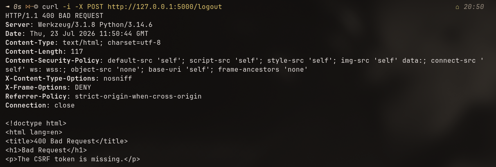
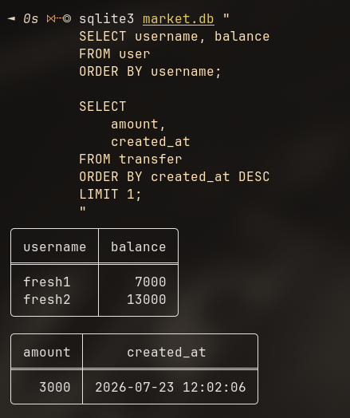
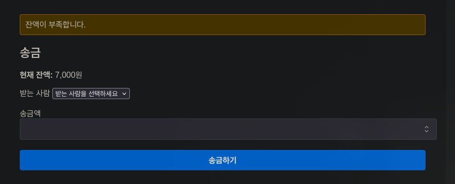
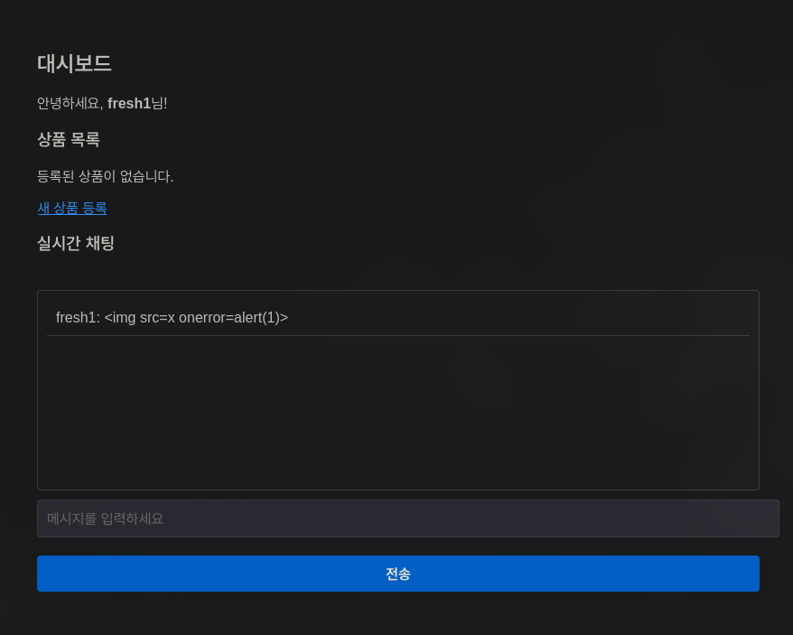
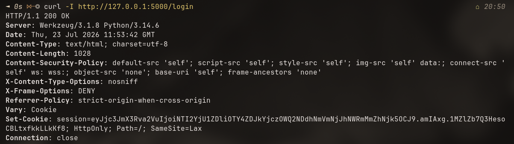
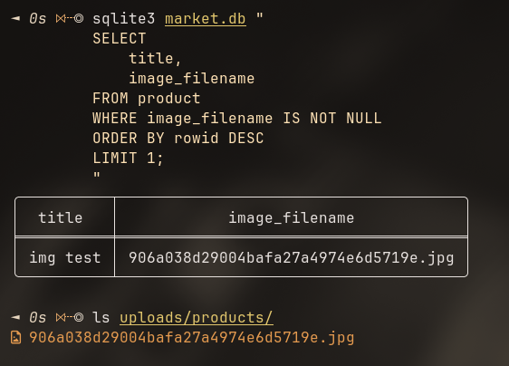
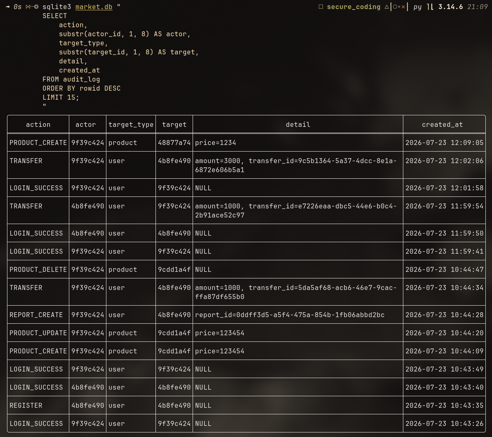

# Tiny Secondhand Shopping Platform 보안 강화 개발 보고서

**프로젝트:** Tiny Secondhand Shopping Platform  
**작성자:** [30반]이승준  
**개발 환경:** Python 3.14 / Flask 3.1 / SQLite  
**작성일:** 2026.07.23

**GitHub Repository:**  
https://github.com/cindysjlee/whs-secure-coding

---

# 1. 프로젝트 개요

## 1.1 프로젝트 목적

본 프로젝트는 Flask 기반의 중고거래 웹 애플리케이션인 Tiny Secondhand Shopping Platform의 기존 기능과 소스 코드를 분석하고, 웹 애플리케이션에서 발생할 수 있는 보안 취약점을 식별하여 이를 개선하는 것을 목적으로 한다.

기존 애플리케이션의 단순한 기능 구현에 그치지 않고 회원가입 및 로그인, 프로필 관리, 상품 관리, 신고, 송금, 실시간 채팅 등 사용자 입력과 상태 변경이 발생하는 기능을 중심으로 보안 요구사항을 분석하였다.

분석 결과를 바탕으로 인증 및 세션 관리, 접근 제어, CSRF(Cross-Site Request Forgery) 방어, XSS(Cross-Site Scripting) 방어, SQL Injection 방어, 입력값 검증, 비밀번호 보호, 파일 업로드 검증, Rate Limiting, 데이터 무결성 보호, 감사 로그 등의 보안 기능을 적용하였다.

또한 구현 이후 정상적인 기능 동작뿐만 아니라 비정상적인 요청 및 공격 상황을 가정한 테스트를 수행하여 적용된 보안 기능의 동작 여부를 검증하였다.

## 1.2 개발 환경

프로젝트의 주요 개발 및 테스트 환경은 다음과 같다.

| 구분          | 환경                                    |
| ------------- | --------------------------------------- |
| 운영체제      | Arch Linux                              |
| 언어          | Python 3.14                             |
| 웹 프레임워크 | Flask 3.1.3                             |
| 데이터베이스  | SQLite                                  |
| 비밀번호 해싱 | Argon2id (`argon2-cffi`)                |
| CSRF 보호     | Flask-WTF                               |
| 실시간 통신   | Flask-SocketIO                          |
| Rate Limiting | Flask-Limiter 및 서버 측 채팅 제한 로직 |
| 이미지 처리   | Pillow                                  |
| 환경변수 관리 | python-dotenv                           |
| 프론트엔드    | HTML, CSS, JavaScript                   |
| 버전 관리     | Git / GitHub                            |

Python 의존성은 `requirements.txt`를 통해 관리하였으며, 실제 비밀정보가 소스 코드 저장소에 포함되지 않도록 `.env`와 `.gitignore`를 이용하였다.

## 1.3 기존 시스템 분석

기존 애플리케이션은 회원가입과 로그인, 프로필 관리, 상품 등록 및 조회, 신고, 송금, 실시간 채팅 등 중고거래 플랫폼의 기본 기능을 제공하는 구조로 구성되어 있었다.

그러나 사용자 입력과 상태 변경 요청에 대한 보안 검증이 충분하지 않은 경우 웹 애플리케이션의 주요 공격 대상이 될 수 있다. 특히 다음과 같은 보안 관점에서의 개선이 필요하다고 판단하였다.

- 사용자 비밀번호의 안전한 저장
- 로그인 실패 반복에 대한 방어
- 세션 및 쿠키 보안
- CSRF를 이용한 상태 변경 요청 위조 방지
- 상품 수정 및 삭제 시 사용자 권한 확인
- 사용자 입력을 이용한 XSS 방지
- SQL Injection 방어
- 송금 요청의 위·변조 및 중복 실행 방지
- 채팅 메시지 위·변조 및 도배 방지
- 악성 파일 업로드 방지
- 신고 기능의 반복적인 악용 방지
- 주요 보안 행위에 대한 추적 가능성 확보
- HTTP 보안 헤더 적용
- 애플리케이션 비밀정보의 소스 코드 분리

따라서 본 프로젝트에서는 제공된 보안 체크리스트를 기반으로 기존 코드를 분석하고 각 기능에 필요한 보안 요구사항을 도출한 뒤 이를 코드와 데이터베이스 수준에서 적용하였다.

---

# 2. 요구사항 분석

## 2.1 기능 요구사항

기존 기능을 유지하면서 다음 기능들이 정상적으로 동작하도록 하는 것을 기본 기능 요구사항으로 설정하였다.

1. 사용자는 회원가입 및 로그인을 할 수 있어야 한다.
2. 로그인한 사용자는 자신의 프로필을 조회하고 수정할 수 있어야 한다.
3. 사용자는 상품을 등록하고 조회할 수 있어야 한다.
4. 상품 소유자는 자신의 상품을 수정하거나 삭제할 수 있어야 한다.
5. 사용자는 다른 사용자 또는 상품을 신고할 수 있어야 한다.
6. 사용자 간 송금이 가능해야 한다.
7. 로그인한 사용자 간 실시간 채팅이 가능해야 한다.
8. 상품 등록 시 이미지를 첨부할 수 있어야 한다.
9. 새로고침 이후에도 저장된 채팅 기록을 확인할 수 있어야 한다.
10. 주요 보안 관련 행위가 감사 로그에 기록되어야 한다.

보안 기능을 추가하면서 기존 기능을 불필요하게 제한하지 않고, 정상적인 요청은 기존과 동일하게 처리하면서 악의적이거나 비정상적인 요청을 서버에서 거부하는 것을 목표로 하였다.

## 2.2 보안 요구사항

제공된 보안 체크리스트와 기존 소스 코드 분석을 바탕으로 다음과 같은 보안 요구사항을 설정하였다.

### 2.2.1 회원가입 및 인증

사용자명과 비밀번호는 클라이언트 측 검증에 의존하지 않고 서버에서도 길이와 형식을 검증해야 한다.

비밀번호는 데이터베이스에 평문으로 저장하지 않고 안전한 비밀번호 해싱 알고리즘을 이용하여 저장해야 한다. 이를 위해 Argon2id를 적용하였다.

또한 공격자가 반복적으로 비밀번호를 추측하는 공격을 수행하지 못하도록 로그인 실패 횟수를 기록하고 일정 횟수 이상 실패한 계정을 일정 시간 잠그도록 설계하였다.

### 2.2.2 세션 보안

로그인 상태는 서버가 관리하는 세션 정보를 기준으로 판단해야 하며, 클라이언트가 전달한 사용자 ID를 인증 정보로 신뢰하지 않아야 한다.

세션 쿠키에는 JavaScript를 통한 접근을 방지하기 위한 `HttpOnly`와 Cross-Site 요청에서 쿠키가 무분별하게 전달되는 것을 완화하기 위한 `SameSite=Lax`를 적용하였다.

또한 로그인 세션은 무기한 유지하지 않고 30분의 만료 시간을 설정하였다.

운영 환경에서는 HTTPS 적용과 함께 `Secure` 쿠키 설정이 추가로 필요하다.

### 2.2.3 CSRF 방어

로그아웃, 프로필 수정, 비밀번호 변경, 상품 등록·수정·삭제, 신고, 송금 등 서버 상태를 변경하는 요청은 GET이 아닌 POST 요청으로 처리하고 CSRF 토큰을 검증해야 한다.

이를 위해 Flask-WTF의 CSRF 보호 기능을 애플리케이션 전체에 적용하고 HTML form에 CSRF 토큰을 삽입하도록 하였다.

### 2.2.4 접근 제어

로그인 여부만 확인하는 것으로 충분하지 않은 기능에 대해서는 객체 단위의 권한 검증이 필요하다.

예를 들어 상품 수정 및 삭제 요청에서는 요청한 사용자가 실제 상품의 `seller_id`와 일치하는지 서버에서 검증해야 한다.

프로필 수정 역시 클라이언트가 전달한 사용자 ID가 아니라 로그인 시 서버 세션에 저장된 `user_id`를 기준으로 처리하도록 설계하였다.

### 2.2.5 입력값 검증 및 XSS 방어

상품 제목, 상품 설명, 가격, 프로필, 신고 사유, 채팅 메시지 등 모든 사용자 입력은 서버 측에서 길이와 형식을 검증해야 한다.

HTML 출력 시에는 Jinja2의 기본 autoescape를 유지하고, 실시간 채팅 메시지를 JavaScript로 화면에 추가할 때 `innerHTML` 대신 `textContent`를 사용하여 사용자 입력이 HTML 또는 JavaScript 코드로 해석되지 않도록 해야 한다.

추가적으로 Content Security Policy를 적용하여 허용되지 않은 스크립트 실행을 제한하도록 하였다.

### 2.2.6 SQL Injection 방어

사용자 입력을 SQL 문자열에 직접 결합하지 않고 SQLite의 parameter binding을 사용해야 한다.

예를 들어 다음과 같이 입력값과 SQL 문장을 분리하여 처리하도록 하였다.

```python
cursor.execute(
    "SELECT * FROM user WHERE username = ?",
    (username,)
)
```

본 프로젝트에서는 SQLAlchemy ORM을 통한 데이터 접근이 아니라 `sqlite3` 기반 쿼리를 사용하므로 모든 SQL 처리에서 parameter binding을 적용하는 것을 보안 요구사항으로 설정하였다.

### 2.2.7 송금 무결성

송금 기능은 단순 입력 검증 외에도 금전 데이터의 무결성을 보장해야 한다.

따라서 다음 조건을 서버에서 검증하도록 하였다.

- 송금액은 양의 정수여야 한다.
- 송금 대상 사용자가 실제로 존재해야 한다.
- 자기 자신에게 송금할 수 없어야 한다.
- 현재 잔액보다 많은 금액을 송금할 수 없어야 한다.
- 출금, 입금, 송금 기록은 하나의 트랜잭션으로 처리되어야 한다.
- 동일한 요청이 중복 실행되어 이중 송금이 발생하지 않아야 한다.

중복 요청 방지를 위해 송금 요청마다 idempotency key를 사용하고 데이터베이스에서도 해당 값을 `UNIQUE`로 제한하였다.

### 2.2.8 실시간 채팅 보안

Socket.IO 연결 및 메시지 전송 시에도 HTTP 기능과 동일하게 로그인 상태를 확인해야 한다.

클라이언트가 전송하는 사용자명은 조작할 수 있으므로 메시지 발신자는 클라이언트가 전달한 값을 신뢰하지 않고 서버 세션의 `user_id`를 기준으로 결정하도록 하였다.

또한 메시지 길이를 제한하고, 짧은 시간 동안 지나치게 많은 메시지를 전송할 경우 일정 시간 메시지 전송을 차단하여 채팅 도배를 방지하도록 하였다.

### 2.2.9 파일 업로드 보안

파일 확장자만 검사하는 경우 공격자가 악성 파일의 확장자를 이미지로 변경하여 업로드할 수 있으므로 실제 이미지 데이터 검증이 필요하다.

따라서 Pillow를 이용하여 이미지 데이터를 확인하고 서버에서 이미지를 다시 인코딩하도록 설계하였다.

원본 파일명 역시 저장 경로에 직접 사용하지 않고 UUID 기반의 새로운 파일명을 생성하여 경로 조작과 파일명 충돌 가능성을 줄이도록 하였다.

### 2.2.10 신고 남용 방지

신고 기능에서는 신고 대상의 실제 존재 여부를 서버에서 검증해야 하며 자기 자신 또는 자신의 상품에 대한 신고를 제한해야 한다.

또한 동일 사용자가 같은 대상을 반복해서 신고하는 것을 방지하기 위해 애플리케이션 수준의 중복 검사와 데이터베이스 `UNIQUE` 제약조건을 함께 적용하도록 하였다.

### 2.2.11 감사 로그

회원가입, 로그인 성공 및 실패, 계정 잠금, 상품 변경, 송금, 신고 등 보안상 의미가 있는 행위는 사후 분석이 가능하도록 감사 로그에 기록해야 한다.

단, 비밀번호, 세션 ID, CSRF 토큰 등 민감한 인증정보는 감사 로그에 기록하지 않는 것을 원칙으로 하였다.

---

# 3. 시스템 설계

## 3.1 전체 애플리케이션 구조

애플리케이션은 Flask를 중심으로 다음과 같은 구조로 구성하였다.

```text
Browser
   │
   ├── HTTP Request
   │      │
   │      ▼
   │   Flask Route
   │      │
   │      ├── 인증/세션 확인
   │      ├── CSRF 검증
   │      ├── 입력값 검증
   │      ├── 권한 검증
   │      │
   │      ▼
   │    SQLite DB
   │
   └── Socket.IO
          │
          ├── 세션 인증
          ├── 메시지 검증
          ├── Rate Limit
          │
          ▼
       Message DB
```

HTTP 요청과 Socket.IO 요청 모두 클라이언트에서 전달된 값을 신뢰하지 않고 서버 세션 및 데이터베이스를 기준으로 사용자의 신원과 권한을 판단하도록 설계하였다.

## 3.2 데이터베이스 설계

데이터베이스는 SQLite를 사용하며 다음 6개의 주요 테이블로 구성하였다.

| 테이블      | 역할                                                     |
| ----------- | -------------------------------------------------------- |
| `user`      | 사용자 계정, 비밀번호 해시, 잔액, 상태, 로그인 실패 정보 |
| `product`   | 상품 정보, 판매자, 상태, 이미지 파일명                   |
| `report`    | 사용자 및 상품 신고 정보                                 |
| `message`   | 채팅 메시지                                              |
| `transfer`  | 사용자 간 송금 내역                                      |
| `audit_log` | 주요 보안 행위 기록                                      |

애플리케이션 시작 시 SQLite의 Foreign Key 기능을 활성화하여 테이블 간 참조 무결성을 적용하였다.

데이터베이스 자체에서도 `CHECK`, `UNIQUE`, `FOREIGN KEY` 제약조건을 이용하였다.

예를 들어 사용자 잔액은 음수가 될 수 없도록 제한하고, 상품 상태와 사용자 상태는 사전에 정의된 값만 저장할 수 있도록 하였다.

송금 테이블에는 다음과 같은 무결성 조건을 적용하였다.

```sql
amount INTEGER NOT NULL CHECK (amount > 0),
idempotency_key TEXT UNIQUE NOT NULL,
CHECK (sender_id <> receiver_id)
```

따라서 애플리케이션의 입력값 검증뿐만 아니라 데이터베이스 수준에서도 잘못된 데이터가 저장될 가능성을 줄였다.



**그림 1. 최종 데이터베이스 테이블 생성 확인**

그림 1과 같이 최종 데이터베이스에는 `user`, `product`, `report`, `message`, `transfer`, `audit_log`의 6개 주요 테이블이 정상적으로 생성된 것을 확인하였다.



**그림 2. 송금 테이블의 데이터 무결성 제약조건 확인**

그림 2와 같이 송금 테이블에는 송금액이 양수임을 보장하는 `CHECK (amount > 0)`, 중복 송금을 방지하기 위한 `idempotency_key`의 `UNIQUE` 제약조건, 자기 자신에게 송금하는 것을 방지하는 `CHECK (sender_id <> receiver_id)`, 사용자 테이블과의 `FOREIGN KEY` 관계가 적용된 것을 확인하였다.

## 3.3 인증 및 세션 설계

사용자 인증은 username과 비밀번호를 이용하며 비밀번호는 Argon2id 해시 형태로 데이터베이스에 저장한다.

로그인 과정은 다음과 같이 설계하였다.

```text
사용자 로그인 요청
        │
        ▼
username 조회
        │
        ├── 사용자 없음 ──→ 로그인 실패
        │
        ▼
계정 상태 / 잠금 여부 확인
        │
        ▼
Argon2id 비밀번호 검증
        │
        ├── 실패 ──→ 실패 횟수 증가
        │              │
        │              └── 기준 초과 → 15분 잠금
        │
        ▼
     로그인 성공
        │
        ├── 기존 세션 초기화
        ├── user_id 저장
        ├── 30분 세션 설정
        └── 실패 횟수 초기화
```

로그인 성공 이후의 사용자 식별은 form 데이터의 사용자 ID가 아니라 서버 세션의 `user_id`를 기준으로 수행한다.

이를 통해 공격자가 요청 데이터의 사용자 ID를 임의로 변경하여 다른 사용자의 권한으로 작업하는 것을 방지하도록 하였다.

## 3.4 CSRF 및 접근 제어 설계

서버의 상태를 변경하는 기능은 POST 요청을 사용하며 Flask-WTF를 이용하여 CSRF 토큰을 검증한다.

각 form에는 다음과 같은 hidden field가 포함된다.

```html
<input type="hidden" name="csrf_token" value="{{ csrf_token() }}" />
```

따라서 정상 페이지에서 발급된 CSRF 토큰이 없는 상태 변경 요청은 서버에서 거부된다.

접근 제어는 두 단계로 구분하였다.

첫 번째는 로그인 여부를 검사하는 인증 단계이고, 두 번째는 현재 로그인한 사용자가 해당 객체를 변경할 권한이 있는지 확인하는 인가 단계이다.

예를 들어 상품 수정 및 삭제의 경우 다음 관계를 확인한다.

```text
session['user_id']
        │
        ▼
현재 로그인 사용자
        │
        ▼
product.seller_id와 비교
        │
   ┌────┴────┐
   │         │
 일치       불일치
   │         │
 수정 허용   요청 거부
```

이를 통해 URL의 `product_id`를 변경하여 다른 사용자의 상품을 수정하거나 삭제하는 방식의 접근 제어 우회를 방지하였다.

## 3.5 송금 무결성 설계

송금은 여러 데이터가 동시에 변경되는 기능이므로 개별 SQL 문장의 성공만으로는 안전성을 보장할 수 없다.

따라서 송금 요청에서는 송신자의 잔액 감소, 수신자의 잔액 증가, 송금 기록 저장을 하나의 논리적인 작업으로 처리하도록 설계하였다.

처리 중 오류가 발생하면 변경사항을 rollback하여 일부 데이터만 변경되는 상황을 방지한다.

또한 사용자가 버튼을 중복 클릭하거나 동일한 HTTP 요청이 재전송되는 상황에서 같은 송금이 두 번 실행되지 않도록 idempotency key를 사용한다.

```text
송금 요청
   │
   ├── 사용자/금액 검증
   ├── 잔액 검증
   ├── idempotency key 검증
   │
   ▼
Transaction
   ├── 송신자 잔액 감소
   ├── 수신자 잔액 증가
   └── transfer 기록
   │
   ▼
Commit
```

## 3.6 실시간 채팅 보안 설계

실시간 채팅에서는 브라우저에서 전달되는 `username`과 같은 인증 관련 데이터를 신뢰하지 않도록 설계하였다.

Socket.IO 메시지를 수신하면 서버가 현재 세션의 `user_id`를 확인하고 데이터베이스에서 실제 사용자 정보를 조회한다.

메시지 역시 서버에서 자료형과 길이를 검증한다.

채팅 도배 방지를 위해 사용자별 메시지 전송 시간을 관리하여 10초 동안 최대 5개의 메시지만 허용하고 기준을 초과한 경우 10초 동안 메시지 전송을 차단하도록 하였다.

화면에 메시지를 출력할 때는 다음과 같이 `textContent`를 사용한다.

```javascript
item.textContent = data.username + ": " + data.message;
```

따라서 `<script>` 또는 이벤트 핸들러가 포함된 문자열이 메시지로 전달되더라도 HTML 코드로 해석되지 않고 일반 문자열로 출력되도록 하였다.

채팅 메시지는 `message` 테이블에 저장하여 페이지 새로고침 이후에도 기존 메시지를 조회할 수 있도록 하였다.

## 3.7 파일 업로드 보안 설계

상품 이미지 업로드 기능에서는 다음과 같은 다단계 검증을 적용하였다.

```text
업로드 요청
    │
    ├── 전체 요청 크기 제한
    │
    ▼
Pillow 이미지 검증
    │
    ├── 이미지 여부 확인
    ├── 이미지 크기 확인
    │
    ▼
서버에서 이미지 재처리
    │
    ▼
UUID 기반 파일명 생성
    │
    ▼
uploads/products 저장
```

파일 확장자만을 신뢰하지 않고 Pillow가 실제 이미지로 처리할 수 있는지를 확인한다.

또한 서버가 이미지를 다시 처리하여 저장함으로써 원본 파일을 그대로 공개 디렉터리에 저장하는 위험을 줄였다.

저장 파일명은 사용자가 제공한 이름 대신 UUID를 사용한다.

## 3.8 HTTP 보안 헤더 설계

모든 HTTP 응답에 공통적으로 보안 헤더를 적용하도록 Flask의 `after_request` 처리를 이용하였다.

적용한 주요 헤더는 다음과 같다.

| 헤더                              | 목적                                         |
| --------------------------------- | -------------------------------------------- |
| `Content-Security-Policy`         | 허용된 출처의 리소스만 로드하도록 제한       |
| `X-Content-Type-Options: nosniff` | MIME type 추측 방지                          |
| `X-Frame-Options: DENY`           | 외부 frame 삽입을 차단하여 Clickjacking 완화 |
| `Referrer-Policy`                 | 외부 요청에 전달되는 referrer 정보 제한      |

특히 JavaScript는 로컬 정적 파일로 제공하여 CSP의 `script-src 'self'` 정책을 적용할 수 있도록 구성하였다.

## 3.9 감사 로그 설계

보안 사고가 발생했을 때 사후 분석이 가능하도록 별도의 `audit_log` 테이블을 설계하였다.

감사 로그는 다음 정보를 저장한다.

- 행위를 수행한 사용자
- 행위 종류
- 대상 종류
- 대상 ID
- 필요한 최소한의 상세정보
- 발생 시간

로그인 성공 및 실패, 계정 잠금, 상품 생성·수정·삭제, 송금, 신고 등의 주요 행위를 기록한다.

단, 로그 자체가 새로운 정보 노출 경로가 되지 않도록 비밀번호, 세션 값, CSRF 토큰과 같은 인증정보는 기록하지 않는다.

---

# 4. 구현 및 보안 취약점 개선

> 다음 장에서는 기존 코드에서 확인한 문제점과 실제 수정 사항을 기능별로 분석한다.

## 4.1 비밀정보 및 환경설정 관리

### 4.1.1 문제점

웹 애플리케이션의 `SECRET_KEY`와 같은 비밀정보를 소스 코드에 직접 작성할 경우 Git 저장소를 통해 값이 외부에 노출될 수 있다. Flask의 `SECRET_KEY`는 세션과 CSRF 토큰의 무결성 보호에 사용되므로 외부에 노출될 경우 인증 및 세션 보안에 영향을 줄 수 있다.

또한 개발 환경에서 사용하는 debug 기능을 운영 환경에서 활성화할 경우 예외 발생 시 내부 코드와 시스템 정보가 사용자에게 노출될 위험이 있다.

### 4.1.2 개선 내용

`python-dotenv`를 이용하여 비밀정보를 `.env` 파일에서 불러오도록 변경하였다. 실제 비밀값이 포함된 `.env`는 `.gitignore`에 등록하고, 저장소에는 필요한 환경변수의 형식만 나타내는 `.env.example`을 제공하였다.

`.env.example`은 다음과 같이 구성하였다.

```env
SECRET_KEY=replace-with-your-secret-key
FLASK_DEBUG=false
```

실제 애플리케이션에서는 환경변수에서 `SECRET_KEY`를 가져오며, 값이 존재하지 않는 경우 임의의 기본값으로 실행하지 않도록 하였다.

이를 통해 개발자가 실수로 하드코딩된 비밀키를 저장소에 공개하는 위험을 줄였다.

---

## 4.2 데이터베이스 무결성 강화

### 4.2.1 문제점

입력값 검증을 애플리케이션 코드에서만 수행할 경우 코드상의 실수나 다른 데이터 입력 경로로 인해 잘못된 값이 데이터베이스에 저장될 가능성이 있다.

또한 SQLite에서는 Foreign Key 검사가 연결별로 활성화되어야 하므로 이를 명시적으로 적용할 필요가 있었다.

### 4.2.2 개선 내용

데이터베이스 연결 시 Foreign Key 기능을 활성화하고 각 테이블에 `NOT NULL`, `CHECK`, `UNIQUE`, `FOREIGN KEY` 등의 제약조건을 추가하였다.

대표적으로 사용자 테이블에는 다음과 같은 조건을 적용하였다.

```sql
balance INTEGER NOT NULL DEFAULT 10000
    CHECK (balance >= 0),

role TEXT NOT NULL DEFAULT 'user'
    CHECK (role IN ('user', 'admin')),

status TEXT NOT NULL DEFAULT 'active'
    CHECK (status IN ('active', 'suspended'))
```

상품 가격 역시 비정상적으로 큰 값이나 음수가 저장되지 않도록 데이터베이스 수준에서 범위를 제한하였다.

```sql
price INTEGER NOT NULL
    CHECK (price >= 0 AND price <= 100000000)
```

송금 데이터에는 양수 금액, 자기 자신에게 송금 금지, 중복 요청 방지를 위한 제약조건을 적용하였다.

```sql
amount INTEGER NOT NULL CHECK (amount > 0),
idempotency_key TEXT UNIQUE NOT NULL,
CHECK (sender_id <> receiver_id)
```

이를 통해 서버 측 입력 검증과 데이터베이스 제약조건을 함께 적용하는 다중 방어 구조를 구성하였다.

---

## 4.3 비밀번호 보안 강화

### 4.3.1 문제점

비밀번호를 평문 또는 안전하지 않은 방식으로 저장할 경우 데이터베이스가 유출되었을 때 사용자의 실제 비밀번호가 직접 노출될 수 있다.

특히 사용자가 여러 서비스에서 동일한 비밀번호를 사용하는 경우 하나의 서비스에서 발생한 정보 유출이 다른 서비스의 계정 탈취로 이어질 가능성이 있다.

### 4.3.2 개선 내용

비밀번호 저장에 `argon2-cffi` 라이브러리를 이용하여 Argon2id 알고리즘을 적용하였다.

회원가입 시 사용자가 입력한 비밀번호 자체를 데이터베이스에 저장하지 않고 Argon2id를 이용하여 생성한 해시값을 저장하도록 변경하였다.

로그인 시에도 입력된 비밀번호를 평문과 직접 비교하지 않고 저장된 Argon2id 해시를 대상으로 검증한다.

또한 비밀번호에 대한 서버 측 형식 검증을 적용하여 비정상적인 입력을 제한하였다.

### 4.3.3 검증

회원가입 후 SQLite 데이터베이스를 직접 조회하여 비밀번호가 평문이 아닌 Argon2id 형식으로 저장되는 것을 확인하였다.



**그림 3. Argon2id를 이용한 비밀번호 해시 저장 확인**

그림 3과 같이 데이터베이스에 저장된 모든 사용자의 비밀번호가 `$argon2id$`로 시작하는 해시값으로 저장되어 있으며, 평문 비밀번호가 저장되지 않는 것을 확인하였다.

---

## 4.4 로그인 실패 및 계정 잠금

### 4.4.1 문제점

로그인 요청 횟수에 제한이 없다면 공격자는 특정 계정에 대해 비밀번호를 반복적으로 추측하는 Brute Force 공격을 수행할 수 있다.

단순히 비밀번호가 틀렸다는 응답만 반환하고 실패 상태를 관리하지 않는 경우 공격 횟수에 사실상 제한이 존재하지 않는다.

### 4.4.2 개선 내용

`user` 테이블에 다음 정보를 추가하여 로그인 실패 상태를 관리하도록 하였다.

```text
failed_login_attempts
locked_until
```

비밀번호 검증에 실패할 때마다 `failed_login_attempts` 값을 증가시키고, 연속 5회 실패하면 해당 계정을 15분 동안 잠그도록 구현하였다.

로그인 성공 시에는 실패 횟수와 잠금 관련 정보를 초기화한다.

이 방식은 IP 주소만을 기준으로 제한하는 방식과 달리 공격자가 IP 주소를 변경하더라도 특정 계정에 대한 무제한적인 비밀번호 추측을 어렵게 한다.

또한 계정 상태가 `suspended`인 사용자에 대해서도 로그인 처리를 제한하도록 구성하였다.

---

## 4.5 세션 및 쿠키 보안

### 4.5.1 세션 쿠키 보호

세션 쿠키에 다음과 같은 보안 설정을 적용하였다.

```python
SESSION_COOKIE_HTTPONLY=True
SESSION_COOKIE_SAMESITE='Lax'
```

`HttpOnly`는 브라우저 JavaScript에서 세션 쿠키에 직접 접근하는 것을 제한하여 XSS 발생 시 세션 쿠키 탈취 위험을 완화한다.

`SameSite=Lax`는 다른 사이트에서 발생한 Cross-Site 요청에 세션 쿠키가 무분별하게 포함되는 것을 제한한다.

### 4.5.2 세션 만료

로그인 세션이 무기한 유지되지 않도록 다음과 같이 세션 유효시간을 30분으로 설정하였다.

```python
PERMANENT_SESSION_LIFETIME=timedelta(minutes=30)
```

로그인 성공 시에는 다음과 같이 permanent session을 사용하도록 설정하였다.

```python
session.permanent = True
```

따라서 설정된 세션 수명 정책에 따라 로그인 세션이 관리된다.

또한 로그인 성공 시 기존 세션 상태를 정리한 뒤 인증된 사용자의 세션을 구성하도록 하여 기존 세션 데이터가 불필요하게 유지되는 것을 방지하였다.

### 4.5.3 민감 작업 재인증

비밀번호 변경과 같은 민감한 작업에서는 로그인 상태만 확인하는 것이 아니라 사용자가 현재 비밀번호를 다시 입력하도록 하였다.

현재 비밀번호에 대한 Argon2 검증이 성공한 경우에만 새로운 비밀번호를 설정할 수 있도록 하여 로그인된 브라우저를 다른 사람이 일시적으로 사용하는 상황에서 발생할 수 있는 계정 탈취 위험을 줄였다.

### 4.5.4 Secure 쿠키 관련 한계

본 프로젝트의 테스트 환경은 `http://127.0.0.1:5000`에서 실행되는 Flask 개발 서버이므로 HTTPS를 적용하지 않았다.

따라서 현재 개발 환경에서는 `Secure` 쿠키를 적용하지 않았으며 실제 운영 환경에서는 HTTPS를 적용한 뒤 다음 설정을 추가해야 한다.

```python
SESSION_COOKIE_SECURE=True
```

이 부분은 현재 개발 환경의 한계 및 향후 개선사항으로 구분하였다.

---

## 4.6 CSRF 방어

### 4.6.1 취약점 개요

CSRF(Cross-Site Request Forgery)는 사용자가 특정 웹 서비스에 로그인된 상태라는 점을 악용하여 공격자가 사용자의 의도와 관계없이 상태 변경 요청을 보내도록 만드는 공격이다.

브라우저는 특정 조건에서 대상 사이트의 쿠키를 요청에 자동으로 포함할 수 있으므로 서버가 단순히 세션 쿠키의 존재만 확인한다면 공격자의 요청과 정상 사용자의 요청을 구분하기 어렵다.

### 4.6.2 개선 내용

Flask-WTF의 CSRF 보호 기능을 애플리케이션 전체에 적용하고 상태 변경을 수행하는 HTML form에 CSRF 토큰을 추가하였다.

```html
<input type="hidden" name="csrf_token" value="{{ csrf_token() }}" />
```

서버가 생성한 토큰과 함께 요청이 전달되어야 정상적인 POST 요청으로 처리된다.

로그아웃 역시 GET 요청만으로 상태를 변경할 수 없도록 POST 방식으로 변경하였다.

### 4.6.3 검증

CSRF 토큰을 포함하지 않고 로그아웃 POST 요청을 직접 전송하여 보호 기능을 검증하였다.



**그림 4. CSRF 토큰이 없는 POST 요청 차단 결과**

그림 4와 같이 CSRF 토큰 없이 상태 변경 요청을 전송한 결과 서버가 `400 Bad Request`를 반환하여 요청을 차단하는 것을 확인하였다.

---

## 4.7 프로필 관리 및 접근 제어

### 4.7.1 문제점

프로필 수정 요청에서 다음과 같이 클라이언트가 전달한 사용자 ID를 기준으로 수정 대상을 선택한다고 가정할 수 있다.

```python
user_id = request.form['user_id']
```

이 경우 공격자가 요청을 직접 수정하여 다른 사용자의 ID를 입력하면 권한이 없는 사용자의 정보를 수정하는 IDOR(Insecure Direct Object Reference) 형태의 접근 제어 문제가 발생할 수 있다.

### 4.7.2 개선 내용

프로필 수정 대상을 클라이언트가 전달하는 사용자 ID로 결정하지 않고 로그인 과정에서 서버가 설정한 다음 값을 기준으로 결정하도록 하였다.

```python
session['user_id']
```

처리 구조는 다음과 같다.

```text
로그인
  │
  └── 서버가 session['user_id'] 설정
                    │
                    ▼
               프로필 수정
                    │
                    ▼
           session['user_id'] 사용
                    │
                    ▼
             자신의 프로필만 수정
```

따라서 공격자가 form 데이터를 임의로 조작하더라도 수정 대상 사용자 자체를 변경할 수 없도록 하였다.

---

## 4.8 상품 등록 및 관리 보안

### 4.8.1 서버 측 입력 검증

상품 등록 시 상품명, 설명, 가격에 대해 서버에서 다시 검증하도록 하였다.

상품명은 1자 이상 100자 이하, 상품 설명은 1자 이상 2,000자 이하로 제한하였다.

가격은 먼저 정수 변환이 가능한지 확인한 뒤 다음 범위에 포함되는지 검사하였다.

```python
0 <= price <= 100_000_000
```

HTML의 `min`, `max`, `maxlength` 등의 속성도 사용하지만 브라우저에서 수행되는 검증은 공격자가 우회할 수 있으므로 실제 보안 검증은 서버 측에서 다시 수행하도록 하였다.

### 4.8.2 SQL Injection 방어

상품 조회를 포함한 데이터베이스 쿼리에서는 사용자 입력을 SQL 문자열에 직접 결합하지 않고 parameter binding을 사용하였다.

```python
cursor.execute(
    "SELECT * FROM product WHERE id = ?",
    (product_id,)
)
```

따라서 사용자 입력이 SQL 문법의 일부가 아니라 하나의 데이터 값으로 처리된다.

### 4.8.3 상품 수정 및 삭제 권한

상품의 URL에 포함된 `product_id`는 사용자가 직접 변경할 수 있으므로 해당 값만으로 수정 또는 삭제 권한을 부여하지 않았다.

서버에서 상품 정보를 조회한 뒤 다음 두 값을 비교하도록 하였다.

```text
product.seller_id
session['user_id']
```

두 값이 일치하는 경우에만 수정 또는 삭제를 허용한다.

이를 통해 다른 사용자의 상품 ID를 알고 있더라도 해당 상품을 임의로 변경하거나 삭제할 수 없도록 하였다.

### 4.8.4 XSS 방어

상품 제목과 설명은 사용자 입력 데이터이므로 HTML 출력 시 코드로 실행되어서는 안 된다.

Jinja2의 기본 autoescape 기능을 유지하여 출력 데이터를 HTML 문법이 아닌 문자열로 처리하도록 하였으며, `|safe`와 같이 사용자 입력의 escape를 무력화하는 기능을 사용하지 않았다.

---

## 4.9 신고 기능 보안

### 4.9.1 신고 대상 검증

신고 요청에서 전달되는 `target_type`, `target_id`, `reason`은 모두 사용자가 변경할 수 있는 데이터이므로 서버에서 다시 검증하였다.

신고 유형은 다음 두 종류만 허용하였다.

```text
user
product
```

신고 사유는 1자 이상 500자 이하로 제한하였다.

### 4.9.2 존재하지 않는 대상 신고 방지

사용자 신고의 경우 `target_id`에 해당하는 실제 사용자가 존재하는지 데이터베이스에서 확인한다.

상품 신고 역시 상품을 직접 조회하여 존재 여부를 확인한다.

따라서 임의의 UUID를 이용하여 존재하지 않는 대상을 신고 데이터로 생성할 수 없도록 하였다.

### 4.9.3 자기 자신 및 자신의 상품 신고 방지

현재 사용자는 다음 세션 값을 기준으로 판단한다.

```python
session['user_id']
```

사용자 신고에서는 `target_id`가 현재 사용자와 같으면 요청을 거부한다.

상품 신고에서는 해당 상품의 `seller_id`가 현재 사용자와 같으면 요청을 거부한다.

### 4.9.4 중복 신고 방지

동일 사용자가 동일한 대상을 반복 신고하는 것을 막기 위해 애플리케이션에서 기존 신고 여부를 먼저 조회한다.

추가적으로 데이터베이스에서도 다음 제약조건을 적용하였다.

```sql
UNIQUE (reporter_id, target_type, target_id)
```

따라서 애플리케이션의 검증이 우회되더라도 데이터베이스에서 동일 신고의 중복 저장을 다시 방지할 수 있다.

정상 신고 후 SQLite를 직접 조회하여 신고 데이터가 정상적으로 저장되는 것을 확인하였다.

---

## 4.10 송금 기능 보안

### 4.10.1 문제점

송금 기능은 일반적인 게시글 작성과 달리 두 사용자의 잔액을 동시에 변경한다.

따라서 다음과 같은 문제가 발생하지 않도록 해야 한다.

- 음수 또는 잘못된 금액 송금
- 존재하지 않는 사용자에게 송금
- 자기 자신에게 송금
- 보유 잔액을 초과하는 송금
- 일부 SQL만 성공하여 잔액이 불일치하는 문제
- 동일 요청의 중복 처리로 인한 이중 송금

### 4.10.2 서버 측 검증

송금액을 서버에서 정수로 변환하고 양수인지 확인한다.

수신자 역시 데이터베이스에서 실제 존재 여부를 확인하며, 현재 로그인 사용자와 동일한 사용자를 수신자로 선택할 수 없도록 하였다.

송금 직전에는 서버가 데이터베이스의 현재 잔액을 기준으로 송금 가능 여부를 판단한다.

클라이언트가 전달한 잔액 값은 신뢰하지 않는다.

### 4.10.3 Transaction 적용

송금은 다음 작업으로 구성된다.

```text
송신자 잔액 감소
        +
수신자 잔액 증가
        +
transfer 기록 생성
```

이 작업들은 하나의 트랜잭션으로 처리한다.

전체 작업이 정상적으로 완료된 경우에만 `commit()`하고 처리 중 오류가 발생하면 `rollback()`하여 일부 데이터만 반영되는 상황을 방지하도록 하였다.

### 4.10.4 중복 송금 방지

각 송금 요청에는 idempotency key를 사용하였다.

데이터베이스에서도 다음과 같이 중복 값을 허용하지 않는다.

```sql
idempotency_key TEXT UNIQUE NOT NULL
```

따라서 동일한 송금 요청이 다시 전달되는 경우 동일 거래가 중복 처리되는 것을 방지할 수 있다.

### 4.10.5 검증

테스트 계정의 초기 잔액을 각각 10,000원으로 설정한 뒤 `fresh1`에서 `fresh2`로 3,000원을 송금하였다.

정상 송금 후 데이터베이스를 조회하여 송신자 `fresh1`의 잔액이 7,000원으로 감소하고 수신자 `fresh2`의 잔액이 13,000원으로 증가한 것을 확인하였다. 또한 `transfer` 테이블에 3,000원의 송금 내역이 정상적으로 저장되었다.



**그림 5. 정상 송금 후 사용자 잔액 및 송금 내역 확인**

이후 송신자의 현재 잔액인 7,000원을 초과하는 8,000원 송금을 시도하였다.



**그림 6. 보유 잔액 초과 송금 차단 결과**

그림 6과 같이 서버에서 `잔액이 부족합니다.`라는 메시지와 함께 요청을 거부하였다. 이후 데이터베이스를 재확인한 결과 두 사용자의 잔액은 각각 7,000원과 13,000원으로 유지되었으며 송금 내역 역시 1건으로 유지되어 실패한 송금으로 인한 데이터 변경이 발생하지 않았음을 확인하였다.

---

## 4.11 실시간 채팅 보안

### 4.11.1 Socket.IO 사용자 인증

HTTP 페이지에서 로그인 검사를 수행하더라도 Socket.IO 이벤트 자체에서 인증을 확인하지 않으면 인증되지 않은 사용자가 직접 이벤트를 전송할 가능성이 있다.

따라서 Socket 연결 및 메시지 처리 시 세션의 로그인 상태를 서버에서 확인하도록 하였다.

### 4.11.2 발신자 위·변조 방지

초기 클라이언트 코드에서는 다음과 같이 username을 브라우저에서 서버로 전달하는 구조가 존재할 수 있다.

```javascript
socket.emit("send_message", {
    username: username,
    message: message,
});
```

그러나 브라우저에서 전달되는 `username`은 개발자 도구나 직접 생성한 Socket.IO 요청을 통해 임의로 변경할 수 있다.

따라서 서버에서는 클라이언트가 주장하는 username을 인증정보로 사용하지 않고 현재 세션의 `user_id`를 기준으로 실제 사용자를 조회하도록 개선하였다.

### 4.11.3 메시지 입력 검증

수신한 메시지의 자료형과 내용을 서버에서 확인하고 최대 길이를 500자로 제한하였다.

빈 메시지 또는 허용 범위를 벗어난 메시지가 데이터베이스에 저장되거나 다른 사용자에게 전송되지 않도록 하였다.

### 4.11.4 DOM XSS 방어

실시간 메시지를 화면에 출력할 때 `innerHTML`을 사용하면 공격자가 다음과 같은 메시지를 전송할 경우 브라우저가 HTML로 해석할 가능성이 있다.

```html

```

이를 방지하기 위해 메시지 출력에 `textContent`를 사용하였다.

```javascript
item.textContent = data.username + ": " + data.message;
```

실제 테스트에서도 다음 문자열을 채팅으로 전송하였다.

```text

```

해당 문자열은 화면에 문자 그대로 출력되었으며 JavaScript가 실행되지 않았다.



**그림 7. 실시간 채팅의 DOM XSS 방어 테스트 결과**

그림 7과 같이 XSS 공격 문자열을 채팅 메시지로 전송하였으나 HTML 요소로 해석되지 않고 문자 그대로 출력되었으며, JavaScript 역시 실행되지 않는 것을 확인하였다.

### 4.11.5 채팅 Rate Limit

짧은 시간 동안 반복적으로 메시지를 전송하여 채팅을 도배하는 행위를 방지하기 위해 사용자별 메시지 전송 횟수를 관리하였다.

현재 정책은 다음과 같다.

```text
10초 동안 최대 5개 메시지 허용
        ↓
기준 초과
        ↓
10초간 메시지 전송 차단
```

차단된 사용자에게는 남은 차단 시간을 안내하는 메시지를 표시하도록 하였다.

이를 통해 단순히 매 6번째 메시지만 거부한 뒤 즉시 다시 전송할 수 있는 방식이 아니라 일정 시간 동안 실제 전송 제한이 유지되도록 개선하였다.

### 4.11.6 메시지 영속성

채팅 메시지를 `message` 테이블에 저장하도록 하였다.

초기에는 실시간으로 수신된 메시지만 브라우저 DOM에 존재하기 때문에 페이지를 새로고침하면 채팅 내역이 사라지는 문제가 있었다.

이를 개선하여 dashboard를 다시 불러올 때 데이터베이스에 저장된 기존 메시지를 조회하고 화면에 출력하도록 하였다.

SQLite에서도 다음과 같이 저장된 메시지를 확인하였다.

```text
sender | content                  | created_at
test1  | 안녕하세요 테스트입니다 | ...
```

---

## 4.12 CSP 및 HTTP 보안 헤더

### 4.12.1 Content Security Policy

XSS 공격에 대한 추가적인 방어 계층을 구성하기 위해 Content Security Policy를 적용하였다.

최종 정책은 다음과 같은 형태로 구성하였다.

```text
default-src 'self';
script-src 'self';
style-src 'self';
img-src 'self' data:;
connect-src 'self' ws: wss:;
object-src 'none';
base-uri 'self';
frame-ancestors 'none'
```

초기에는 inline JavaScript와 style 때문에 `'unsafe-inline'`이 필요했으나 JavaScript와 CSS를 정적 파일로 분리하여 최종적으로 `script-src 'self'` 정책을 적용할 수 있도록 개선하였다.

Socket.IO 클라이언트 라이브러리 역시 외부 CDN에 의존하지 않고 로컬 정적 파일로 제공하도록 변경하였다.

### 4.12.2 기타 보안 헤더

추가로 다음 HTTP 보안 헤더를 적용하였다.

```text
X-Content-Type-Options: nosniff
X-Frame-Options: DENY
Referrer-Policy: strict-origin-when-cross-origin
```

HTTP 응답 헤더를 직접 조회하여 보안 헤더와 세션 쿠키 설정을 확인하였다.



**그림 8. HTTP 보안 헤더 및 세션 쿠키 설정 확인**

그림 8과 같이 `Content-Security-Policy`, `X-Content-Type-Options`, `X-Frame-Options`, `Referrer-Policy`가 정상적으로 적용되었으며, 세션 쿠키에는 `HttpOnly`와 `SameSite=Lax` 속성이 설정된 것을 확인하였다. 현재 로컬 개발 환경은 HTTP를 사용하므로 `Secure` 속성은 적용하지 않았으며, 운영 환경에서는 HTTPS와 함께 활성화해야 한다.

---

## 4.13 이미지 업로드 보안

### 4.13.1 문제점

사용자가 업로드한 파일을 확장자만 검사하여 그대로 저장하는 방식은 안전하지 않다.

공격자는 실제 내용이 이미지가 아닌 파일에 `.jpg` 등의 확장자를 붙일 수 있으며, 사용자가 제공한 파일명을 그대로 사용할 경우 파일명 충돌이나 경로 관련 문제가 발생할 수도 있다.

### 4.13.2 요청 크기 제한

대용량 파일을 이용한 자원 고갈 공격을 완화하기 위해 업로드 요청 크기를 제한하였다.

현재 애플리케이션에서는 최대 요청 크기를 5 MiB로 제한하였다.

### 4.13.3 실제 이미지 검증

단순한 확장자 검사에 의존하지 않고 Pillow를 이용하여 업로드된 데이터를 이미지로 처리할 수 있는지 검증하도록 하였다.

검증을 통과한 이미지도 원본 파일을 그대로 저장하지 않고 서버에서 다시 처리하여 JPEG 형태로 저장하도록 하였다.

이를 통해 확장자만 이미지로 변경한 위장 파일을 차단할 수 있도록 하였다.

### 4.13.4 UUID 파일명

사용자가 제공한 원본 파일명을 서버의 저장 파일명으로 사용하지 않고 UUID 기반의 새로운 파일명을 생성하였다.

실제 이미지 파일을 첨부하여 상품을 등록한 후 데이터베이스와 서버의 이미지 저장 디렉터리를 확인하였다.



**그림 9. UUID 기반 이미지 파일명 저장 결과**

그림 9과 같이 업로드된 이미지의 원본 파일명을 그대로 사용하지 않고 UUID 기반의 새로운 파일명으로 변경하여 데이터베이스와 서버 파일 시스템에 저장하는 것을 확인하였다.

### 4.13.5 상품 삭제와 파일 정리

상품 레코드를 삭제하면서 이미지 파일을 계속 보존하면 사용되지 않는 파일이 서버에 누적될 수 있다.

따라서 이미지가 등록된 상품을 삭제할 경우 관련 이미지 파일도 함께 정리하도록 구현하였다.

---

## 4.14 감사 로그

### 4.14.1 필요성

공격이나 비정상적인 동작이 발생했을 때 현재 데이터만으로는 과거에 어떤 행위가 발생했는지 확인하기 어렵다.

특히 로그인, 계정 잠금, 송금, 상품 변경 등의 행위는 보안 사고 발생 시 추적이 필요하다.

### 4.14.2 구현

다음 구조의 `audit_log` 테이블을 추가하였다.

```sql
CREATE TABLE audit_log (
    id TEXT PRIMARY KEY,
    actor_id TEXT,
    action TEXT NOT NULL,
    target_type TEXT,
    target_id TEXT,
    detail TEXT,
    created_at TEXT NOT NULL DEFAULT CURRENT_TIMESTAMP,

    FOREIGN KEY (actor_id)
        REFERENCES user(id)
);
```

감사 로그에는 대표적으로 다음과 같은 행위를 기록하도록 하였다.

```text
회원가입
로그인 성공
로그인 실패
계정 잠금
상품 생성
상품 수정
상품 삭제
송금
신고
```

감사 로그에는 필요한 최소 정보만 기록하고 비밀번호, 세션 ID, CSRF 토큰 등의 인증정보는 저장하지 않도록 하였다.

### 4.14.3 검증

회원가입, 로그인, 상품 생성·수정·삭제, 신고 및 송금 등의 기능을 실제로 수행한 후 `audit_log` 테이블을 조회하여 주요 보안 관련 행위가 정상적으로 기록되는지 확인하였다.



**그림 10. 주요 보안 행위 감사 로그 기록 결과**

그림 10과 같이 `REGISTER`, `LOGIN_SUCCESS`, `PRODUCT_CREATE`, `PRODUCT_UPDATE`, `PRODUCT_DELETE`, `REPORT_CREATE`, `TRANSFER` 등의 이벤트가 감사 로그에 기록된 것을 확인하였다. 또한 각 이벤트에는 행위 사용자, 대상 유형 및 ID, 세부 정보와 발생 시간이 함께 저장되어 주요 행위에 대한 사후 추적이 가능하도록 구성하였다.

---

# 5. 테스트 및 검증

본 프로젝트에서는 각 보안 기능을 구현한 뒤 정상적인 사용 시나리오와 비정상적인 요청을 모두 이용하여 기능을 검증하였다.

특히 기존 개발 데이터에 의존하여 테스트가 성공하는 상황을 방지하기 위해 최종 단계에서는 기존 `market.db`를 제거한 뒤 애플리케이션을 다시 실행하여 데이터베이스 전체를 새롭게 생성하였다.

이후 신규 환경에서 회원가입부터 주요 기능까지 전체 Smoke Test를 다시 수행하였다.

## 5.1 테스트 환경

최종 구현이 기존 개발 데이터나 이전 데이터베이스 구조에 의존하지 않는지 확인하기 위해 기존 `market.db` 파일을 삭제한 후 애플리케이션을 다시 실행하였다.

이를 통해 `init_db()`에 정의된 데이터베이스 스키마가 처음부터 정상적으로 생성되는지 확인하였다.

테스트 환경은 다음과 같다.

| 구분          | 환경                                        |
| ------------- | ------------------------------------------- |
| 운영체제      | Arch Linux                                  |
| Python        | 3.14.6                                      |
| Flask         | 3.1.3                                       |
| Database      | SQLite                                      |
| WebSocket     | Flask-SocketIO                              |
| Password Hash | Argon2id                                    |
| CSRF          | Flask-WTF                                   |
| 테스트 서버   | Flask Development Server (`127.0.0.1:5000`) |

새로운 데이터베이스에서 회원가입부터 로그인, 상품, 신고, 송금, 채팅 등의 기능을 순서대로 테스트하였다.

---

## 5.2 데이터베이스 초기화 검증

기존 데이터베이스를 삭제하고 애플리케이션을 다시 실행한 후 SQLite의 `.schema` 명령을 이용하여 테이블 생성 상태를 확인하였다.

최종적으로 다음 6개의 테이블이 정상적으로 생성되는 것을 확인하였다.

| 테이블      | 용도                     |
| ----------- | ------------------------ |
| `user`      | 사용자 계정 및 잔액 관리 |
| `product`   | 중고 상품 정보 관리      |
| `report`    | 사용자 및 상품 신고 관리 |
| `message`   | 채팅 메시지 저장         |
| `transfer`  | 사용자 간 송금 기록      |
| `audit_log` | 주요 보안 이벤트 기록    |

또한 Foreign Key, CHECK, UNIQUE 등의 데이터베이스 제약조건도 새로운 데이터베이스에 정상적으로 반영되는 것을 확인하였다.

따라서 개발 과정에서 기존 데이터베이스에 직접 적용한 변경사항에 의존하지 않고, 새로운 환경에서도 `init_db()`를 통해 최종 데이터베이스 구조를 생성할 수 있음을 확인하였다.

---

## 5.3 주요 기능 통합 테스트

새로운 데이터베이스를 기준으로 주요 기능을 순차적으로 테스트하였다.

### 5.3.1 회원가입 및 로그인

새로운 사용자 두 명을 생성하고 정상적으로 로그인할 수 있는지 확인하였다.

회원가입 후 데이터베이스를 조회하여 비밀번호가 평문이 아닌 Argon2id 해시 형태로 저장되는 것을 확인하였다.

잘못된 비밀번호를 입력할 경우 로그인 실패 횟수가 증가하며, 정상적인 비밀번호를 입력하면 로그인할 수 있음을 확인하였다.

### 5.3.2 프로필

로그인한 사용자가 자신의 프로필을 수정할 수 있는지 확인하였다.

프로필 수정 대상은 클라이언트가 전달하는 임의의 사용자 ID가 아닌 현재 세션의 사용자 ID를 기준으로 결정되도록 하였다.

비밀번호 변경 시에는 현재 비밀번호를 다시 입력하도록 하여 민감 작업에 대한 재인증이 수행되는 것도 확인하였다.

### 5.3.3 상품

상품 등록, 조회, 수정, 삭제를 테스트하였다.

상품 수정 및 삭제는 상품의 `seller_id`와 현재 세션의 `user_id`가 일치하는 경우에만 수행되도록 확인하였다.

상품 가격에 대해서는 정수 여부 및 허용 범위를 서버에서 검증하였다.

이미지 업로드 기능에서는 정상적인 JPEG 이미지가 등록되는 것을 확인하였으며, 저장 파일명은 사용자가 입력한 원본 파일명이 아닌 UUID 기반의 이름으로 변경되었다.

이미지로 인식할 수 없는 파일을 업로드한 경우에는 등록이 차단되는 것을 확인하였다.

### 5.3.4 신고

다른 사용자 또는 다른 사용자가 등록한 상품을 신고할 수 있는지 확인하였다.

존재하지 않는 대상, 자기 자신 및 자신의 상품에 대한 신고는 서버에서 차단하도록 하였다.

동일한 사용자가 동일한 대상을 반복해서 신고하는 경우에도 중복 신고가 허용되지 않도록 검증하였다.

### 5.3.5 송금

두 테스트 계정의 잔액을 각각 10,000원으로 설정한 상태에서 3,000원을 송금하였다.

송금 후 데이터베이스에서 다음 결과를 확인하였다.

```text
송신자:  7,000원
수신자: 13,000원
```

이후 송신자의 잔액보다 큰 8,000원의 송금을 시도하였으며 서버가 해당 요청을 거부하는 것을 확인하였다.

이를 통해 정상 송금과 잔액 초과 송금 방어가 모두 정상적으로 동작함을 확인하였다.

### 5.3.6 실시간 채팅

로그인한 사용자 상태에서 Socket.IO를 통해 메시지를 전송하고 다른 클라이언트에 실시간으로 전달되는 것을 확인하였다.

다음 XSS 테스트 문자열도 메시지로 전송하였다.

```html

```

브라우저에서는 해당 값이 HTML 요소로 해석되지 않고 문자열 그대로 출력되었으며 JavaScript도 실행되지 않았다.

또한 전송된 메시지가 `message` 테이블에 저장되는 것을 확인하였다.

페이지를 새로고침한 후에도 데이터베이스에 저장된 기존 메시지가 다시 출력되는 것을 확인하였다.

연속적인 메시지 전송을 통해 Rate Limit도 테스트하였으며 설정된 기준을 초과한 경우 일정 시간 동안 추가 메시지가 차단되고 사용자에게 남은 대기 시간이 표시되는 것을 확인하였다.

---

## 5.4 CSRF 테스트

상태를 변경하는 모든 HTML form에 CSRF 토큰이 적용되어 있는지 확인하였다.

대상에는 다음 기능이 포함된다.

- 회원가입
- 로그인
- 로그아웃
- 프로필 수정
- 비밀번호 변경
- 상품 등록
- 상품 수정
- 상품 삭제
- 송금
- 신고

CSRF 토큰 없이 POST 요청을 직접 전송한 결과 서버가 `400 Bad Request`를 반환하며 요청을 거부하는 것을 확인하였다.

또한 로그아웃 기능을 POST 방식으로 제한하여 GET 요청으로 상태를 변경할 수 없도록 하였다.

---

## 5.5 XSS 테스트

사용자가 입력할 수 있는 상품 정보, 프로필, 신고 사유 및 채팅 메시지가 브라우저에서 실행 가능한 HTML 또는 JavaScript로 처리되지 않는지 확인하였다.

특히 채팅에서는 XSS 테스트 문자열을 실제로 전송하여 검증하였다.

```html

```

해당 입력은 화면에 문자열 그대로 출력되었으며 `alert()`가 실행되지 않았다.

Jinja2 템플릿에서는 기본 autoescape를 유지하고 사용자 입력에 `|safe`를 적용하지 않았다.

JavaScript에서도 채팅 메시지를 출력할 때 `innerHTML` 대신 `textContent`를 사용하였다.

추가적으로 CSP를 적용하여 스크립트 실행 경로를 제한하였다.

---

## 5.6 SQL Injection 방어 확인

애플리케이션의 SQL 쿼리를 검토하여 사용자 입력을 SQL 문자열에 직접 연결하지 않고 SQLite parameter binding을 사용하도록 하였다.

대표적인 조회 코드는 다음과 같다.

```python
cursor.execute(
    "SELECT * FROM product WHERE id = ?",
    (product_id,)
)
```

`?` placeholder를 이용하여 사용자 입력을 SQL 명령의 일부가 아닌 데이터로 전달하므로 SQL Injection 위험을 완화하였다.

본 프로젝트에서는 SQLAlchemy ORM을 전면적으로 사용하지는 않았지만 SQLite 쿼리에 parameter binding을 일관되게 적용하는 방식으로 SQL Injection을 방어하였다.

---

## 5.7 HTTP 보안 설정 확인

`curl`을 이용하여 로그인 페이지의 HTTP 응답 헤더를 확인하였다.

```bash
curl -I http://127.0.0.1:5000/login
```

다음 보안 헤더가 적용된 것을 확인하였다.

```text
Content-Security-Policy: default-src 'self'; script-src 'self'; style-src 'self'; img-src 'self' data:; connect-src 'self' ws: wss:; object-src 'none'; base-uri 'self'; frame-ancestors 'none'
X-Content-Type-Options: nosniff
X-Frame-Options: DENY
Referrer-Policy: strict-origin-when-cross-origin
```

세션 쿠키에도 다음 속성이 적용된 것을 확인하였다.

```text
HttpOnly
SameSite=Lax
```

다만 현재 테스트 환경에서는 HTTP 기반 Flask 개발 서버를 사용하므로 `Secure` 속성은 활성화하지 않았다.

운영 환경에서는 HTTPS/WSS 적용과 함께 `SESSION_COOKIE_SECURE=True`를 활성화해야 한다.

---

## 5.8 감사 로그 검증

로그인, 상품 생성 및 삭제 등의 작업을 수행한 후 `audit_log` 테이블을 직접 조회하였다.

실제 테스트 과정에서 다음과 같은 이벤트가 저장되는 것을 확인하였다.

```text
REGISTER
LOGIN_SUCCESS
PRODUCT_CREATE
PRODUCT_UPDATE
PRODUCT_DELETE
REPORT_CREATE
TRANSFER
```

각 이벤트에는 행위를 수행한 사용자, 대상 종류, 대상 ID 및 발생 시간이 함께 기록되었다.

이를 통해 주요 보안 이벤트 발생 후 사후 추적이 가능하도록 하였다.

---

## 5.9 최종 Smoke Test

모든 주요 기능 구현이 완료된 이후 기존 `market.db`를 삭제하고 새로운 데이터베이스를 생성하여 전체 기능을 다시 테스트하였다.

테스트 종료 후 각 테이블의 레코드 수를 확인한 결과는 다음과 같았다.

```text
users       2
products    0
reports     1
transfers   1
messages    1
audit_logs 10
```

상품의 레코드 수가 0인 것은 상품 등록 및 삭제 테스트를 모두 수행하여 최종적으로 상품이 삭제된 상태이기 때문이다.

신고, 송금, 메시지 및 감사 로그 데이터가 새로운 데이터베이스에서도 정상적으로 생성된 것을 확인하였다.

이를 통해 기존 개발 데이터에 의존하지 않고 애플리케이션의 주요 기능이 처음부터 정상적으로 동작함을 검증하였다.

---

# 6. 보안 체크리스트 최종 점검

제공된 보안 체크리스트를 기준으로 최종 구현 상태를 점검하였다.

| 영역        | 점검 항목              | 결과                | 적용 내용                                                                |
| ----------- | ---------------------- | ------------------- | ------------------------------------------------------------------------ |
| 회원/프로필 | 서버 측 입력 검증      | 충족                | 사용자명 및 비밀번호 형식과 길이를 서버에서 검증                         |
| 회원/프로필 | CSRF 보호              | 충족                | Flask-WTF 기반 CSRF 토큰 적용                                            |
| 회원/프로필 | 비밀번호 보안          | 충족                | Argon2id 해시 저장                                                       |
| 회원/프로필 | 세션 쿠키              | 부분 충족           | HttpOnly, SameSite 적용. Secure는 HTTPS 운영 환경에서 적용 필요          |
| 회원/프로필 | 세션 만료 및 재인증    | 충족                | 30분 세션 만료 및 비밀번호 변경 시 현재 비밀번호 재확인                  |
| 회원/프로필 | 실패 로그인 방어       | 충족                | 연속 실패 횟수 기록 및 계정 임시 잠금                                    |
| 회원/프로필 | 오류 메시지            | 충족                | debug 비활성화 및 사용자용 오류 처리                                     |
| 상품 관리   | 폼 입력 검증           | 충족                | 제목, 설명, 가격 서버 측 검증                                            |
| 상품 관리   | XSS 방어               | 충족                | Jinja autoescape 및 안전한 DOM 출력                                      |
| 상품 관리   | 인증 사용자 제한       | 충족                | 로그인 세션 확인                                                         |
| 상품 관리   | 소유자 확인            | 충족                | seller_id와 session user_id 비교                                         |
| 상품 관리   | 데이터 무결성          | 충족                | 서버 검증 및 DB CHECK/FK 적용                                            |
| 채팅        | 메시지 내용 검증       | 충족                | 자료형, 공백, 길이 제한                                                  |
| 채팅        | 사용자 인증            | 충족                | Socket 연결 및 이벤트에서 세션 확인                                      |
| 채팅        | 메시지 검증            | 충족                | 서버가 세션 기준으로 발신자 결정                                         |
| 채팅        | Rate Limiting          | 충족                | 사용자별 도배 탐지 및 일정 시간 차단                                     |
| 채팅        | 연결 암호화            | 운영 환경 적용 필요 | 개발 환경은 HTTP/WS, 운영 시 HTTPS/WSS 필요                              |
| 신고        | 폼 입력 검증           | 충족                | 신고 유형, 대상, 사유 검증                                               |
| 신고        | 인증 사용자 접근       | 충족                | 로그인 세션 확인                                                         |
| 신고        | 무결성 및 로그         | 충족                | DB 제약조건 및 감사 로그 적용                                            |
| 신고        | 남용 방지              | 부분 충족           | 동일 대상 중복 신고 차단. 관리자 검토 기능은 미구현                      |
| 전체        | ORM 및 파라미터 바인딩 | 충족                | ORM 전면 사용 대신 SQLite parameter binding 적용                         |
| 전체        | 데이터베이스 권한      | 부분 충족           | SQLite 파일 DB 특성상 별도 DB 사용자 권한 모델 없음                      |
| 전체        | 보안 헤더              | 충족                | CSP, X-Frame-Options, X-Content-Type-Options 등 적용                     |
| 전체        | HTTPS                  | 운영 환경 적용 필요 | 로컬 개발 서버에서는 HTTP 사용                                           |
| 전체        | 에러 및 예외 처리      | 충족                | debug 비활성화 및 주요 DB 작업 예외 처리                                 |
| 전체        | 의존성 관리            | 부분 충족           | requirements.txt로 버전을 명시하였으며 운영 시 정기적인 취약점 점검 필요 |

체크리스트를 기준으로 대부분의 애플리케이션 수준 보안 요구사항을 구현하였다.

HTTPS/WSS, Secure Cookie와 같은 항목은 실제 TLS 인증서 및 운영 서버 구성이 필요한 항목이므로 로컬 개발 환경에서는 적용하지 않았다.

또한 SQLite는 서버형 DBMS와 달리 별도의 데이터베이스 사용자 및 권한 모델을 제공하지 않으므로 데이터베이스 최소 권한 항목은 애플리케이션 파일 접근 권한 및 배포 환경에서 추가적으로 관리해야 한다.

신고 기능에서는 동일 대상에 대한 중복 신고를 방지하였으나 신고 건수 기반 제한이나 관리자 검토 인터페이스까지는 구현하지 않았다.

따라서 해당 항목들은 구현 누락으로 숨기기보다는 현재 개발 환경 및 프로젝트 범위에 따른 한계로 명시하였다.

# 7. 유지보수 및 한계

## 7.1 의존성 관리

프로젝트에서 사용하는 Python 라이브러리는 `requirements.txt`를 통해 버전을 명시하였다.

주요 보안 관련 라이브러리는 다음과 같다.

```text
Flask
Flask-WTF
Flask-SocketIO
Flask-Limiter
argon2-cffi
python-dotenv
Pillow
```

새로운 환경에서는 가상환경을 생성한 뒤 다음 명령으로 필요한 패키지를 설치할 수 있다.

```bash
python -m venv .venv
source .venv/bin/activate
pip install -r requirements.txt
```

라이브러리에는 새로운 보안 취약점이 지속적으로 발견될 수 있으므로 실제 서비스를 운영하는 경우 정기적으로 의존성의 보안 업데이트 여부를 확인해야 한다.

---

## 7.2 환경변수 관리

`SECRET_KEY`와 같이 외부에 공개되어서는 안 되는 설정은 소스 코드와 분리하였다.

실제 환경변수 파일인 `.env`는 Git 저장소에 포함되지 않도록 `.gitignore`에 등록하였다.

배포 또는 프로젝트 실행에 필요한 환경변수의 형식은 `.env.example`을 통해 제공한다.

```env
SECRET_KEY=replace-with-your-secret-key
FLASK_DEBUG=false
```

새로운 환경에서는 `.env.example`을 참고하여 별도의 `.env` 파일을 생성하고 충분히 안전한 `SECRET_KEY`를 설정해야 한다.

---

## 7.3 데이터베이스 초기화 및 스키마 관리

데이터베이스 테이블은 애플리케이션의 `init_db()`에서 생성하도록 구성하였다.

따라서 기존 개발용 `market.db` 파일이 없는 새로운 환경에서도 애플리케이션 실행을 통해 필요한 테이블을 생성할 수 있다.

개발 과정에서 상품 이미지 기능 등을 추가하면서 기존 데이터베이스에 `ALTER TABLE`을 이용해 컬럼을 추가한 경우가 있었지만, 최종적으로는 해당 변경사항을 모두 `init_db()`의 최초 생성 스키마에 반영하였다.

이를 통해 기존 데이터베이스 파일에 의존하지 않고 새로운 환경에서도 동일한 최종 스키마를 구성할 수 있도록 하였다.

다만 현재 프로젝트에는 별도의 데이터베이스 마이그레이션 도구가 존재하지 않는다. 실제 운영 환경에서 이미 데이터가 저장된 상태로 스키마를 변경해야 하는 경우 Alembic 등의 마이그레이션 도구를 도입하는 것이 적절하다.

---

## 7.4 HTTPS 및 WSS

현재 프로젝트는 로컬 개발 환경의 Flask Development Server를 이용하여 다음 주소에서 테스트하였다.

```text
http://127.0.0.1:5000
```

따라서 현재 환경에서는 TLS가 적용되지 않았으며 HTTP 및 WS 통신을 사용한다.

실제 운영 환경에서는 HTTPS를 적용하고 Socket.IO 통신 역시 WSS를 통해 이루어지도록 구성해야 한다.

HTTPS 환경에서는 다음과 같은 Secure Cookie 설정도 활성화해야 한다.

```python
SESSION_COOKIE_SECURE=True
```

또한 Flask Development Server를 인터넷에 직접 노출하지 않고 운영용 WSGI 서버 및 Reverse Proxy를 사용하는 것이 필요하다.

---

## 7.5 SQLite 사용에 따른 한계

본 프로젝트는 간단한 중고거래 플랫폼 과제라는 범위를 고려하여 SQLite를 사용하였다.

SQLite는 별도의 데이터베이스 서버가 필요하지 않고 설정이 간단하다는 장점이 있지만 실제 대규모 서비스에서는 다음과 같은 한계가 존재한다.

- 다수 사용자의 동시 쓰기 처리에 제한이 존재한다.
- DBMS 수준의 사용자 및 세부 권한 관리 기능이 제한적이다.
- 서비스 규모가 커질수록 데이터베이스 운영 및 확장이 어렵다.

실제 서비스 환경에서는 PostgreSQL 또는 MySQL과 같은 서버형 DBMS를 사용하고 애플리케이션 전용 계정에 필요한 최소 권한만 부여하는 방식이 적절하다.

---

## 7.6 신고 관리 기능의 한계

현재 신고 기능에서는 동일 사용자가 동일 사용자 또는 상품을 반복 신고하는 것을 제한하였다.

애플리케이션에서 기존 신고를 조회하는 것뿐만 아니라 다음 데이터베이스 제약조건도 적용하였다.

```sql
UNIQUE (reporter_id, target_type, target_id)
```

따라서 단순한 반복 신고에 대한 기본적인 남용 방지는 구현되어 있다.

그러나 실제 중고거래 서비스에서는 다음과 같은 추가 기능이 필요하다.

- 일정 시간 동안 제출할 수 있는 신고 건수 제한
- 관리자용 신고 목록 및 상세 조회
- 신고 승인 및 기각 처리
- 악의적인 허위 신고 사용자 관리
- 반복 신고 대상에 대한 자동 탐지
- 신고 처리 이력 관리

현재 `report` 테이블에는 `pending`, `resolved` 상태를 저장할 수 있지만 별도의 관리자 신고 관리 페이지는 구현하지 않았다.

---

## 7.7 감사 로그 관리의 한계

`audit_log` 테이블을 추가하여 로그인과 상품 변경 등 주요 행위를 추적할 수 있도록 하였다.

그러나 현재 감사 로그는 애플리케이션과 동일한 SQLite 데이터베이스에 저장된다.

실제 서비스에서는 공격자가 데이터베이스에 높은 수준의 접근 권한을 획득한 경우 서비스 데이터뿐만 아니라 감사 로그까지 변경하거나 삭제할 가능성을 고려해야 한다.

따라서 운영 환경에서는 로그를 별도의 로그 서버 또는 중앙 로그 관리 시스템으로 전송하고 애플리케이션 서버에서 임의로 수정하기 어렵도록 관리하는 것이 바람직하다.

또한 장기간 운영되는 서비스에서는 로그 보관 기간과 개인정보 처리 정책을 함께 고려해야 한다.

---

## 7.8 파일 업로드 관리의 한계

상품 이미지 업로드에서는 파일 크기 제한, Pillow를 이용한 실제 이미지 검증, UUID 기반 파일명 생성 등의 보안 대책을 적용하였다.

그러나 실제 서비스에서는 다음과 같은 추가적인 보안 대책을 고려할 수 있다.

- 이미지 해상도 제한
- 이미지 처리 시 자원 사용량 제한
- 업로드 파일 전용 저장소 사용
- 악성 파일 검사
- 파일 저장 영역과 애플리케이션 실행 영역의 분리
- 클라우드 Object Storage 사용

현재 구현은 과제 규모에서 파일 업로드를 안전하게 처리하기 위한 기본적인 방어를 적용한 수준이다.

---

## 7.9 채팅 기능의 한계

현재 실시간 채팅에는 사용자 인증, 메시지 검증, XSS 방어, 데이터베이스 저장 및 Rate Limit을 적용하였다.

그러나 Rate Limit 상태는 애플리케이션 프로세스 수준에서 관리되므로 서버가 여러 대로 확장되는 환경에서는 각 서버의 제한 상태가 서로 일치하지 않을 수 있다.

실제 분산 환경에서는 Redis와 같은 공유 저장소를 사용하여 사용자별 Rate Limit 상태를 중앙에서 관리하는 방식이 필요하다.

또한 운영 환경에서는 Socket.IO 연결을 WSS로 암호화해야 한다.

---

## 7.10 향후 개선 방향

본 프로젝트를 실제 서비스 수준으로 확장한다면 다음 항목을 우선적으로 개선할 수 있다.

1. HTTPS 및 WSS 적용
2. PostgreSQL 등의 서버형 DBMS 도입
3. 데이터베이스 마이그레이션 시스템 도입
4. 관리자용 신고 처리 기능 구현
5. Redis 기반 Rate Limiting 적용
6. 감사 로그 중앙 관리
7. 파일 업로드 전용 저장소 구성
8. 자동화된 보안 테스트 추가
9. 의존성 취약점 자동 점검
10. 운영 환경에서의 접근 권한 최소화

현재 프로젝트에서는 이러한 운영 인프라 수준의 기능보다 애플리케이션에서 직접 구현하고 검증할 수 있는 주요 보안 취약점 개선에 중점을 두었다.

---

# 8. 결론

본 프로젝트에서는 기본적인 중고거래 플랫폼을 대상으로 기능 구현과 함께 웹 애플리케이션에서 발생할 수 있는 다양한 보안 취약점을 분석하고 개선하였다.

단순히 기능을 추가하는 것에 그치지 않고 사용자로부터 전달되는 데이터는 신뢰할 수 없다는 원칙을 기준으로 서버 측 입력 검증, 인증 및 인가, 데이터베이스 무결성, 세션 관리 등의 보안 요소를 적용하였다.

회원 및 인증 기능에서는 Argon2id를 이용한 비밀번호 해시 저장, 로그인 실패 횟수 관리 및 계정 잠금, 세션 만료, CSRF 보호, 민감 작업 재인증 등을 적용하였다.

상품 관리에서는 서버 측 입력 검증과 소유자 검증을 통해 다른 사용자의 상품을 임의로 수정하거나 삭제할 수 없도록 하였으며, 사용자 입력 출력 과정에서 XSS가 발생하지 않도록 처리하였다.

파일 업로드 기능에서는 단순한 파일 확장자만 신뢰하지 않고 Pillow를 이용하여 실제 이미지 데이터를 검증하고 UUID 기반의 새로운 파일명을 사용하여 저장하도록 하였다.

송금 기능에서는 잔액과 수신자 정보를 서버에서 검증하고 여러 데이터 변경 작업을 하나의 트랜잭션으로 처리하였다. 또한 idempotency key를 사용하여 동일 요청의 중복 처리로 인해 이중 송금이 발생할 가능성을 줄였다.

실시간 채팅에서는 Socket.IO 연결 및 메시지 처리 과정에서 사용자 인증을 확인하고 클라이언트가 전달한 사용자명을 신뢰하지 않도록 하였다. 메시지 출력에는 `textContent`를 사용하여 DOM 기반 XSS를 방어하였으며 메시지 저장과 Rate Limiting을 추가하여 채팅 기능의 안정성과 보안성을 강화하였다.

신고 기능에서는 존재하지 않는 대상이나 자기 자신에 대한 신고를 차단하고 데이터베이스의 UNIQUE 제약조건을 이용하여 동일 대상에 대한 중복 신고를 방지하였다.

전체 시스템에는 Content Security Policy와 여러 HTTP 보안 헤더를 적용하였으며 주요 보안 이벤트를 `audit_log`에 기록하여 사후 추적이 가능하도록 하였다. 또한 `SECRET_KEY` 등의 민감한 설정을 환경변수로 분리하여 소스 코드 저장소를 통한 비밀정보 노출 위험을 줄였다.

최종 검증에서는 기존 데이터베이스를 제거한 뒤 새로운 환경에서 데이터베이스를 처음부터 생성하고 회원가입, 로그인, 프로필, 상품, 신고, 송금, 채팅 등의 주요 기능을 다시 테스트하였다. 이를 통해 개발 과정에서 생성된 기존 데이터나 임시 데이터베이스 구조에 의존하지 않고 최종 애플리케이션이 정상적으로 동작하는 것을 확인하였다.

다만 본 프로젝트는 로컬 개발 환경을 기준으로 수행되었기 때문에 HTTPS/WSS, Secure Cookie, 서버형 DBMS의 최소 권한 계정, 중앙 로그 관리 등 실제 운영 인프라가 필요한 보안 요소는 직접 적용하지 않았다.

이번 프로젝트를 통해 웹 애플리케이션의 보안은 특정 취약점 하나를 수정하는 것으로 완료되는 것이 아니라 입력 검증, 인증, 인가, 세션, 데이터베이스, 네트워크, 로깅 등 여러 계층에서 방어를 적용해야 한다는 점을 확인할 수 있었다.

또한 클라이언트에서 수행하는 검증만으로는 보안을 보장할 수 없으며 중요한 검증과 권한 판단은 반드시 서버에서 수행하고, 가능한 경우 데이터베이스 제약조건과 같은 추가적인 방어 계층을 함께 적용해야 한다는 점을 확인하였다.
